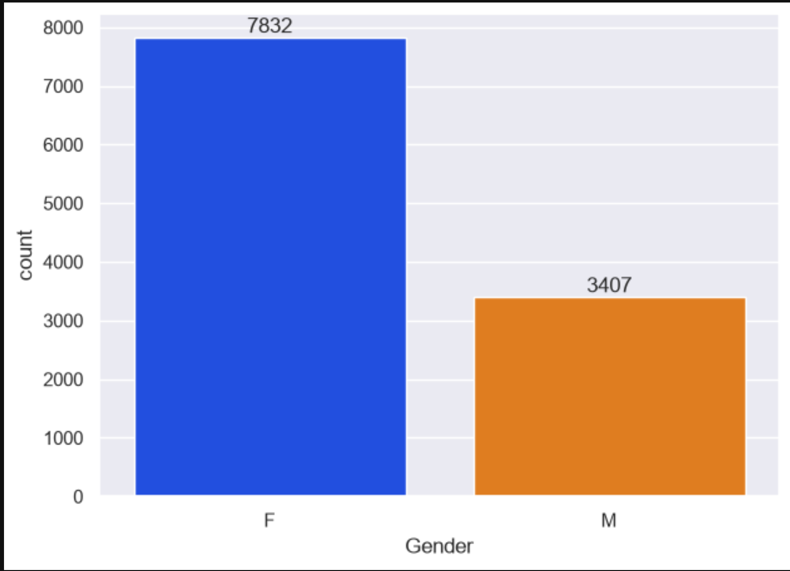
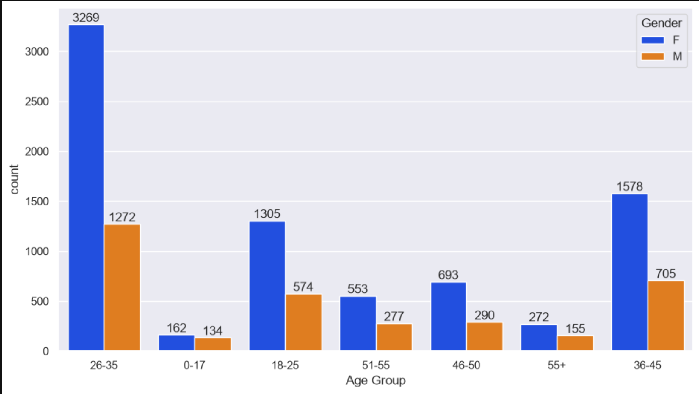
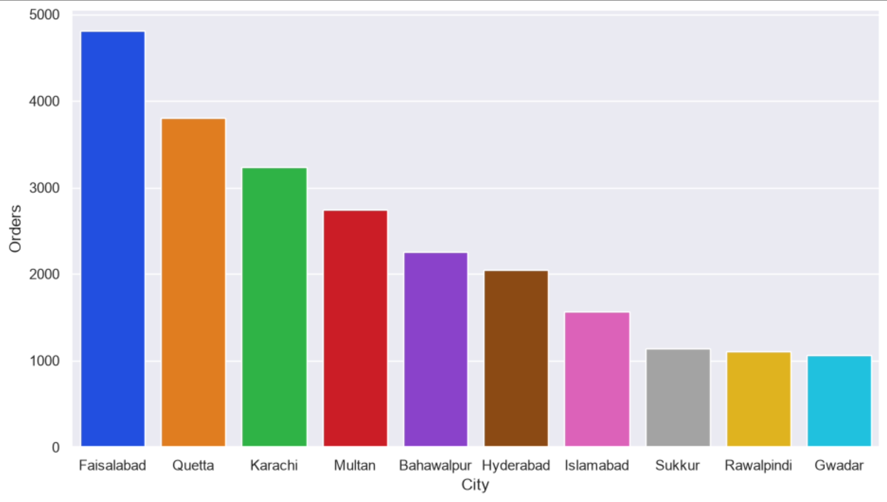

# Eid Sales Data Analysis

## Overview
A short exploratory data analysis of Eid sales data using pandas, numpy, matplotlib, and seaborn.
This was my first data analysis project, built to practice grouping, aggregation, and visualization.

## Dataset
- `Eid_Sales_Data.csv` — sales transaction data including customer demographics, 
  city, occupation, product category, and order amount.

## What I Analyzed
- Sales distribution by gender
- Sales by age group
- Top-performing cities
- Sales by marital status
- Sales by occupation
- Sales by product category

## Key Findings
- Females account for ~70% of total sales, driven by a larger customer base rather 
  than higher spending per order
- The 26–45 age range contributes over 60% of total revenue
- Faisalabad, Quetta, Karachi, and Multan together make up over 50% of total sales
- IT, Healthcare, Aviation, and Banking are the top-spending occupation sectors
- Food, Clothing & Apparel, and Electronics & Gadgets are the top-selling categories

## Tools Used
- Python
- pandas, numpy
- matplotlib, seaborn
- Jupyter Notebook

## How to Run
1. Clone this repo
2. Install dependencies: `pip install -r requirements.txt`
3. Open `Festival_data_analysis.ipynb` in Jupyter and run all cells

## Screenshots

*Females account for ~70% of total sales, driven by a larger customer base.*

*The 26–45 age range contributes the majority of total revenue.*

*Faisalabad, Quetta, Karachi, and Multan lead in total orders.*
